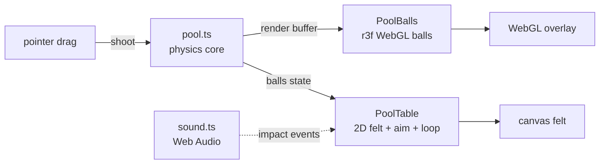
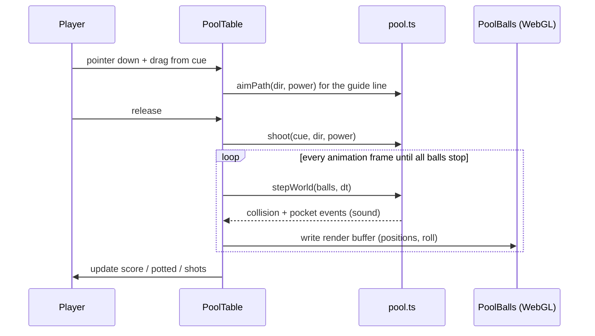

# Country Pool

Play pool where every ball is a glossy 3D country flag - a landscape-first billiards table rendered with WebGL.


[](LICENSE)


## Contents

- [Features](#features)
- [Architecture](#architecture)
- [How it works](#how-it-works)
- [Tech stack](#tech-stack)
- [Quick start](#quick-start)
- [Configuration](#configuration)
- [Project layout](#project-layout)
- [License](#license)

## Features

- 15 object balls, each a real national flag on a glossy 3D WebGL sphere, plus a pearl-white cue ball.
- Drag-to-aim slingshot control: pull back from the cue ball, a colour-coded guide line (green -> amber -> red by power) shows the shot line and its first cushion bounce, release to break.
- Full 2D pool physics: elastic ball-on-ball collisions, cushion bounces, six pockets, sub-stepped integration so nothing tunnels at speed.
- Pocket a flag to score; a scratched cue respots on the head string; clear the rack to win with a fanfare.
- Synthesised sound (cue crack, ball clicks scaled by impact, rail thud, pocket drop) - zero audio files.
- Landscape-first table that fills the screen, with a rotate hint on portrait and iOS safe-area insets.

## Architecture

A pure, deterministic physics core drives everything; rendering is split cleanly from simulation. The physics runs in abstract table units and writes a per-frame render buffer. A transparent react-three-fiber canvas reads that buffer to place glossy flag spheres, while a 2D canvas underneath paints the felt, brass pockets, ball shadows and the aim guide. React state is touched only for the HUD, never per frame.



| Layer | File | Role |
|-------|------|------|
| Physics | `lib/pool.ts` | Pure, DOM-free: balls, collisions, cushions, pockets, aim geometry, rack |
| Sound | `lib/sound.ts` | Runtime-synthesised Web Audio, graceful no-op fallback |
| Game loop | `app/components/PoolTable.tsx` | Single rAF loop, felt/aim canvas, drag-to-aim input, HUD |
| 3D balls | `app/components/PoolBalls.tsx` | react-three-fiber overlay, glossy spheres from the render buffer |
| Lighting | `app/components/Studio.tsx` | r3f lights + environment for the clearcoat sheen |

## How it works



## Tech stack

- Next.js 16 (App Router, static prerender) + React 19, TypeScript strict.
- three.js 0.185 with react-three-fiber and drei for the glossy MeshPhysicalMaterial balls.
- HTML5 Canvas 2D for the felt, rails, pockets and aim guide.
- Web Audio API for all sound (synthesised, no assets).
- Tailwind CSS 4 for the HUD and overlays.
- node:test for the physics unit suite; ESLint 9. Deployed on Vercel.

## Quick start

```bash
git clone https://github.com/bunlongheng/country-pool.git
cd country-pool
npm install
npm run dev
```

Open http://localhost:3031 and turn the device to landscape. Pull back from the white cue ball, aim the line, and release to break. `npm test` runs the physics suite.

## Configuration

No environment variables required.

## Project layout

```
country-pool/
├── app/
│   ├── components/
│   │   ├── PoolTable.tsx    # game loop, felt canvas, drag-to-aim, HUD
│   │   ├── PoolBalls.tsx    # react-three-fiber glossy flag-ball overlay
│   │   ├── Studio.tsx       # r3f lighting + environment
│   │   └── SoundToggle.tsx  # mute toggle
│   ├── data/countries.ts    # 194 countries (code, name, hue)
│   ├── layout.tsx           # self-hosted fonts, metadata
│   ├── page.tsx
│   └── globals.css
├── lib/
│   ├── pool.ts              # pure physics core (unit-tested)
│   └── sound.ts             # Web Audio synth engine
├── tests/pool.test.ts       # 8 node:test unit tests
├── public/flags/            # 194 flag PNGs
└── next.config.ts           # CSP + security headers
```

## License

[MIT](LICENSE) (c) Bunlong Heng
