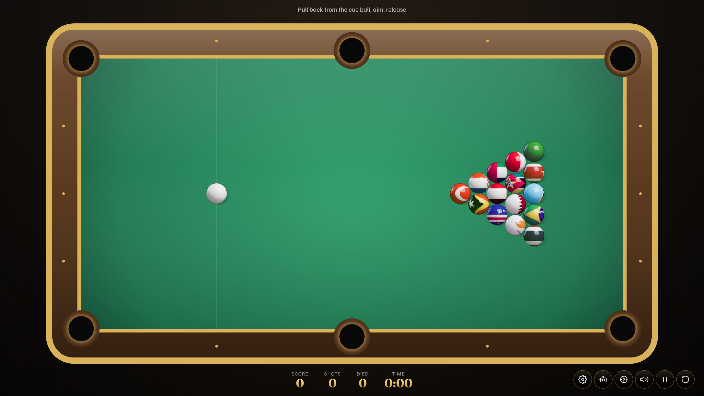
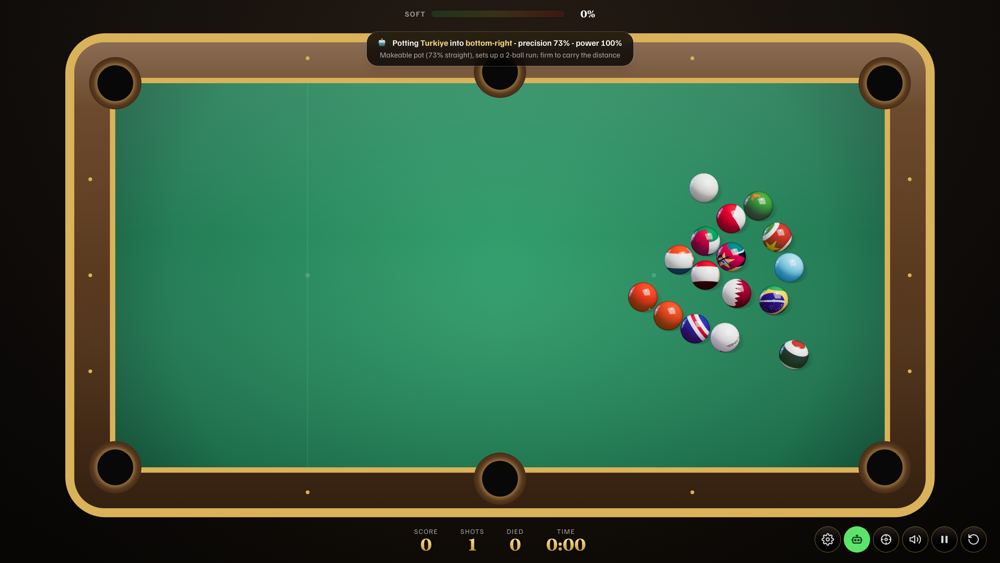
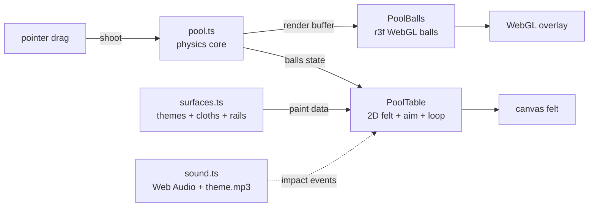
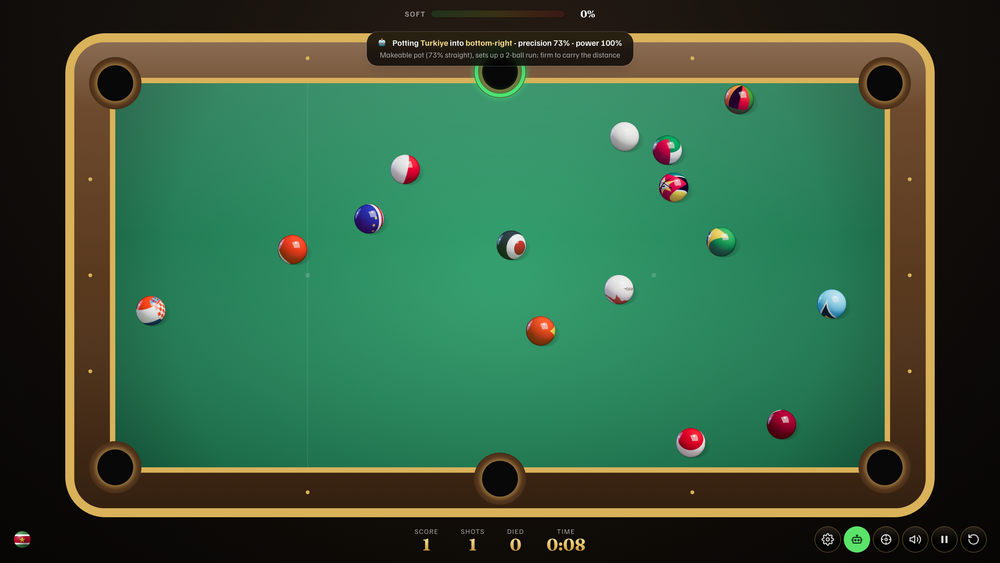

# Country Pool

Play pool where every ball is a glossy 3D country flag - a landscape-first billiards table rendered with WebGL.



[](https://github.com/bunlongheng/country-pool/actions/workflows/ci.yml)
[](LICENSE)


## Contents

- [Features](#features)
- [Architecture](#architecture)
- [How it works](#how-it-works)
- [Design decisions and trade-offs](#design-decisions-and-trade-offs)
- [Tech stack](#tech-stack)
- [Quick start](#quick-start)
- [Configuration](#configuration)
- [Project layout](#project-layout)
- [License](#license)

- **AI mode**: a look-ahead computer player that clones the whole table, simulates every candidate shot to a full stop, refuses to scratch, and narrates each shot (target flag, pocket, straightness, reasoning) while it runs the rack in the fewest turns.
- **Replay**: a World-Cup-style highlight reel of the rack - per-move chapters, a scrubber, slow-mo playback, and a score synced to every frame.
- 15 object balls, each a real national flag on a glossy 3D WebGL sphere, plus a pearl-white cue ball.
- Drag-to-aim slingshot control: pull back from the cue ball, a colour-coded guide line (green -> amber -> red by power) shows the shot line and its first cushion bounce, release to break. Above 90% power, fire wraps the cue ball and the meter blinks red.
- Full 2D pool physics: elastic ball-on-ball collisions, cushion bounces, six pockets (recessed, realistic side pockets that reject lazy rail rolls), sub-stepped integration so nothing tunnels at speed and no ball is ever shoved over the frame.
- Pot an object flag and the pocket blinks green; scratch the cue and it blinks red, then the cue respots on the head string. Clear the rack to win with a fanfare.
- The HUD tracks **Score**, **Shots** (strokes taken), **Died** (scratches), and rack **Time**.
- **Kids mode**: a ghost-ball aim assist that shows the contact point and the struck ball's direction.
- **Settings** (persisted to localStorage): **Ball Size** (Normal / Big / Huge, resizes the real physics), **Cloth Color** (10 felt shades), **Table Frame** (Wood / Walnut / Leather / Black / Metal / Aluminum, with matching pocket rims and gloss), and **Cue Stick** (5 finishes).
- Synthesised sound effects (cue crack scaled by power + a fire boom, ball clicks by impact, rail thud, pocket drop, scratch, win) plus a looping background theme; one mute toggle silences both.
- Landscape-first table that fills the screen, with a rotate hint on portrait and iOS safe-area insets.



## Architecture

A pure, deterministic physics core drives everything; rendering is split cleanly from simulation. The physics runs in abstract table units and writes a per-frame render buffer. A transparent react-three-fiber canvas reads that buffer to place glossy flag spheres, while a 2D canvas underneath paints the themed felt, framed rails, pockets, ball shadows and the aim guide. Table theming (surfaces, cloth colours, rail materials) lives in a pure data module. React state is touched only when a turn settles, never per frame.



| Layer | File | Role |
|-------|------|------|
| Physics + AI | `lib/pool.ts` | Pure, DOM-free: balls, collisions, cushions, pockets, aim geometry, rack, ball sizing, look-ahead AI shot planner |
| Themes | `app/data/surfaces.ts` | Pure paint data: 10 cloth colours, 6 rail/frame materials, 5 cue sticks + gloss |
| Sound | `lib/sound.ts` | Runtime-synthesised SFX + a looping theme (`public/theme.mp3`), graceful no-op fallback |
| Game loop | `app/components/PoolTable.tsx` | Single rAF loop, felt/aim canvas, drag-to-aim input, HUD, settings, AI driver, replay reel |
| 3D balls | `app/components/PoolBalls.tsx` | react-three-fiber overlay, glossy spheres from the render buffer |
| Lighting | `app/components/Studio.tsx` | r3f lights + environment for the clearcoat sheen |

## How it works




## Design decisions and trade-offs

| Decision | Chosen | Alternative | Why this trade-off | Cost we accept |
|----------|--------|-------------|--------------------|----------------|
| Physics | Pure, DOM-free core in table units | Physics baked into the render loop | Fully unit-testable and deterministic; render and sim stay decoupled | A render buffer has to be marshalled each frame |
| AI | Full look-ahead simulation of each shot | Cheap geometry heuristic | It knows exactly where every ball lands, never scratches, and plans run-outs | More CPU per turn than a heuristic |
| Side pockets | Recessed, reject lazy rail rolls | Generous circular capture | Rail-parallel skims roll past like real pool | Needs a directional mouth check, not just distance |
| Audio | Synthesised at runtime (Web Audio) | Bundled audio files | No files, no licensing, CSP stays `'self'` | SFX are tuned in code, not authored in a DAW |

## Tech stack

- Next.js 16 (App Router, static prerender) + React 19, TypeScript strict.
- three.js 0.185 with react-three-fiber and drei for the glossy MeshPhysicalMaterial balls.
- HTML5 Canvas 2D for the themed felt, framed rails, pockets and aim guide.
- Web Audio API for synthesised sound effects, plus a native `<audio>` element for the looping theme (`public/theme.mp3`, served same-origin).
- Tailwind CSS 4 for the HUD, settings tabs and overlays.
- node:test for the physics unit suite; ESLint 9. Deployed on Vercel.

## Quick start

```bash
git clone https://github.com/bunlongheng/country-pool.git
cd country-pool
npm install
npm run dev
```

Open http://localhost:3031 and turn the device to landscape. Pull back from the white cue ball, aim the line, and release to break. Tap the gear to open Settings. `npm test` runs the physics suite.

## Configuration

No environment variables required.

## Project layout

```
country-pool/
├── app/
│   ├── components/
│   │   ├── PoolTable.tsx    # game loop, felt canvas, drag-to-aim, HUD, settings, AI, replay
│   │   ├── PoolBalls.tsx    # react-three-fiber glossy flag-ball overlay
│   │   └── Studio.tsx       # r3f lighting + environment
│   ├── data/
│   │   ├── countries.ts     # 194 countries (code, name, hue)
│   │   └── surfaces.ts      # 10 cloth colours, 6 rail materials, 5 cue sticks
│   ├── layout.tsx           # self-hosted fonts, metadata
│   ├── page.tsx
│   └── globals.css
├── lib/
│   ├── pool.ts              # pure physics core + look-ahead AI planner (unit-tested)
│   └── sound.ts             # Web Audio synth + theme playback
├── tests/pool.test.ts       # 19 node:test unit tests
├── public/
│   ├── flags/               # 194 flag PNGs
│   └── theme.mp3            # looping background theme
└── next.config.ts           # CSP + security headers
```

## License

[MIT](LICENSE) (c) Bunlong Heng - covers the code. `public/theme.mp3` is not covered by the MIT license.
